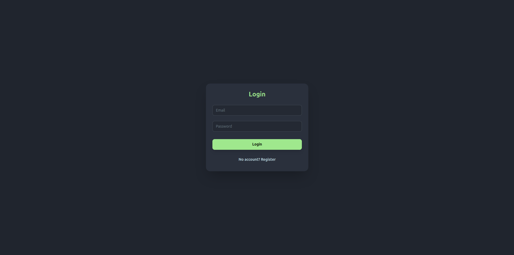
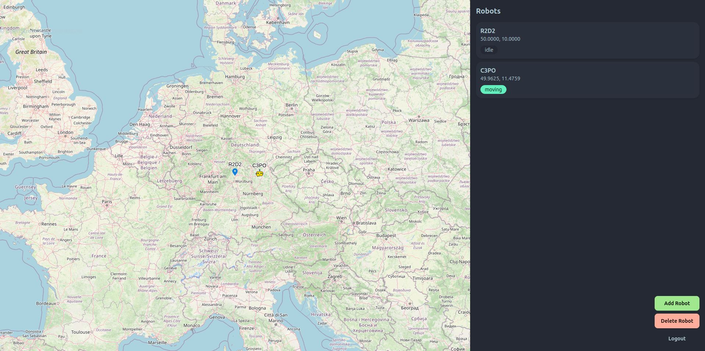

# Mini Fleet Monitor

Eine Full-Stack-Webanwendung zur Überwachung virtueller Roboter in Echtzeit.

---

## Setup

1. Repository klonen:

```bash
git clone <dein-repo-url>
cd <projekt-ordner>
```

2. Anwendung mit Docker starten:

```bash
docker compose up --build
```

3. Anwendung im Browser öffnen:

http://localhost:5174

---

## Demo Login

Email: [admin@test.com](mailto:admin@test.com)
Passwort: test123

---

## Architektur

Die Anwendung basiert auf einer Client-Server-Architektur. Das Backend wurde mit Node.js und Express entwickelt und verwendet PostgreSQL als Datenbank sowie Redis als Cache. Die Authentifizierung erfolgt über JWT. Echtzeit-Updates werden über WebSockets bereitgestellt. Das Frontend basiert auf React und nutzt OpenLayers zur Darstellung der Roboter auf einer Karte.

---

## Screenshots

### Login-Seite



### Karte mit Robotern



---

## Features

- JWT-basierte Authentifizierung
- Echtzeit-Updates der Roboter (WebSocket)
- Interaktive Karte (OpenLayers)
- Roboter hinzufügen / löschen
- Redis-Caching (TTL 10 Sekunden)

---
